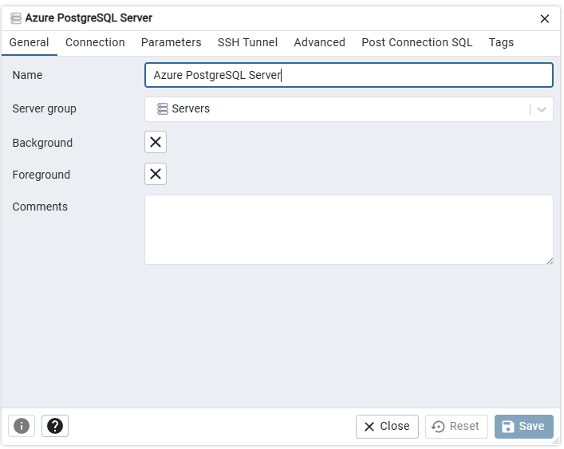
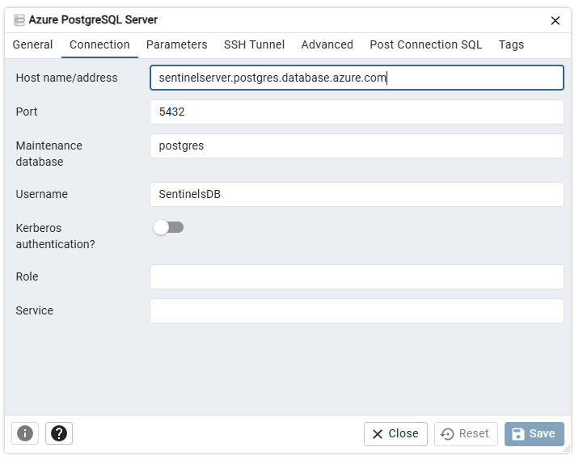
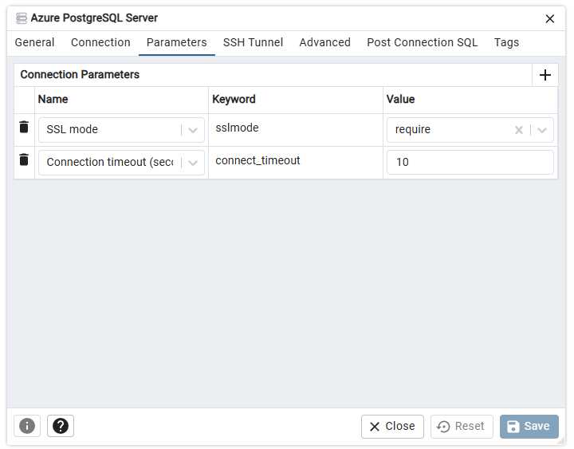

## 🛠️ Getting Started

### Step: Create Your Environment File

1. Copy the example environment configuration:
   ```bash
   cp .env.example .env
   ```

2. Open `.env` and insert the necessary credentials using the steps below.

---

## 🔐 Authentication Setup

This app supports two types of login:

* **Google OAuth 2.0 Login**
* **Email + Password Login**

FastAPI sessions are secured using cookie-based sessions via `SessionMiddleware`.

### Step 1: Google OAuth Setup

1. Go to [Google Cloud Console](https://console.cloud.google.com/).
2. Select your project (or create a new one).
3. Navigate to: `APIs & Services > Credentials`.
4. Click **Create Credentials > OAuth client ID**.
5. Choose **Web application**.
6. Under **Authorized JavaScript origins**, add:

   * `http://localhost:3000`
7. Under **Authorized redirect URIs**, add:

   * `http://localhost:8000/auth/callback`
8. Save and copy:

   * **Client ID**
   * **Client Secret**

Add these to your `.env` file:

```env
GOOGLE_CLIENT_ID=your_client_id
GOOGLE_CLIENT_SECRET=your_client_secret
```

---

### Step 2: Session Secret Key

Generate a secure key:

```bash
python -c "import secrets; print(secrets.token_hex(32))"
```

Add this to your `.env` file:

```env
SESSION_SECRET_KEY=your_generated_secret_key
```

---

## Azure AI Translator Setup

To enable subtitle translation:

1. Go to [Azure Portal](https://portal.azure.com/).
2. Navigate to **Create a resource > AI + Machine Learning > Translator**.
3. Fill in the required fields:

   * **Resource Name**: e.g., `subtitle-translator-api`
   * **Region**: e.g., `northeurope`
   * **Pricing Tier**: Choose **F0 (free)** or **S1 (standard)**
4. Click **Review + Create**, then **Create**.
5. Once the resource is created:

   * Go to **Keys and Endpoint**
   * Copy:

     * **Key 1**
     * **Region**
     * **Endpoint** (e.g., `https://api.cognitive.microsofttranslator.com/`)

Add these to your `.env` file:

```env
AZURE_SUBSCRIPTION_KEY=your_key_1
AZURE_REGION=your_region
AZURE_TRANSLATOR_ENDPOINT=https://api.cognitive.microsofttranslator.com
AZURE_LANGUAGES_URL=https://api.cognitive.microsofttranslator.com/languages?api-version=3.0&scope=translation
```

---

# ☁️ Azure Blob Storage

## 1. Set Up Azure Storage Account in Azure Portal

1.  **Log in to Azure Portal:** Go to [portal.azure.com](https://portal.azure.com).

2.  **Create a Storage Account:**
    * In the Azure Portal search bar, type "Storage accounts" and select it.
    * Click `+ Create`.
    * Fill in the required details:
        * **Subscription:** Choose Azure subscription.
        * **Resource group:** Create a new one or select an existing one (e.g., `subtitle-translator-rg`).
        * **Storage account name:** Choose a globally unique name (e.g., `subtitleappstorage123`). This name will be part of blob URLs.
        * **Region:** Select a region close to you or your users (e.g., `uksouth`).
        * **Performance:** Standard.
        * **Redundancy:** Locally-redundant storage (LRS).
    * Click `Review + Create`, then `Create`. Wait for the deployment to complete.

3.  **Create Blob Containers:**
    Once your storage account is deployed:
    * Navigate to your newly created Storage Account.
    * In the left-hand menu, under "Data storage," select `Containers`.
    * Click `+ Container` to create two new containers:
        * **Name:** `original-subtitles`
        * **Public access level:** `Private (no anonymous access)`
        * Click `Create`.
        * Repeat for the second container:
        * **Name:** `translated-subtitles`
        * **Public access level:** `Private (no anonymous access)`
        * Click `Create`.

4.  **Get the Connection String:**
    Your application will use a connection string to authenticate with the Storage Account.
    * In your Storage Account, in the left-hand menu, under "Security + networking," select `Access keys`.
    * You will see `key1` and `key2`. Copy the **Connection string** for `key1`. This is a long string that starts with `DefaultEndpointsProtocol=https;...`. Keep this safe!

---

## 2FA

### What it includes:
  * TOTP-based 2FA using Authenticator Apps (Google, Microsoft, Authy)

  * Secure QR code setup at /setup-2fa

  * OTP entry verification at /verify-2fa

  * 2FA enforced on:

  * Google OAuth login

  * Email/password login

  * Session upgrade after OTP validation only

### Backend Endpoints:
  * GET /setup-2fa – generate QR and TOTP secret

  * POST /verify-2fa-setup – enable 2FA by verifying one valid OTP

  * POST /verify-2fa – verify OTP at login

  * /me – determines whether to show /setup-2fa, /verify-2fa, or dashboard

## How to setup 2FA:

After logging in, users will be prompted to enable 2FA for enhanced security.

### Steps for End Users:
1. Login using Google or email/password

    * If you haven't set up 2FA yet, you'll be redirected to the /setup-2fa page

2. Scan the QR code:
    * Open your preferred Authenticator App (e.g., Google Authenticator, Microsoft Authenticator, Authy).

    * Tap the + icon to add a new account.

    * Select “Scan QR Code” and scan the QR code shown on the screen.

3. Enter the 6-digit code:
    * After scanning, your app will start generating 6-digit OTP codes.

    * Enter the current 6-digit code shown in your app into the input field on /setup-2fa.

4. Click “Verify & Enable 2FA”:
    * If the code is correct, your 2FA will be activated.

    * From now on, you'll be asked to enter a fresh OTP every time you log in.

### Supported Authenticator Apps:
  * Google Authenticator (iOS, Android)

  * Microsoft Authenticator

  * Authy

  * 1Password

  * LastPass Authenticator

---

## Integrating with PostgreSQL

### Step 1: Install PostgreSQL:
https://www.postgresql.org/download/


### Step 2: Update .env:
Copy-paste the content for the PostgreSQL as it is in youe .env file

### Step 3: Integrating with Azure PostgreSQL flexible Server:
* Login to Azure portal
* In Sentinels group find **sentinelserver**
* In **sentinelserver** there is an option called **Connect to VS CODE**
* Foloow the steps and complete the conntection
* Open the VS Code, you will get a pop up asking for the connection, accept it and enter the password given in the .env file
* To test the connection, run the command
```bash
psql -h sentinelserver.postgres.database.azure.com -U SentinelsDB -d postgres -W
```
* If successful you can run the backend.

### Step 4: Checking the schema in pgAdmin:
* Open pgAdmin and create a new server.

    

    You can give any name to your server


    

    The Conntection tab should be like given in the image

    

    In Paramrters tab make sure that SSL mode value = require

* After all this is done click save and your Azure PostgreSQL Server is created.

### Optional: Test DB Connection:
You can test if your database is connected by hitting this FastAPI endpoint:
```bash
GET http://localhost:8000/db-test
```
If successful, it will return:
```json
{ "message": "Database connection successful" }
```

---

## Running the Project

### Start the Backend

```bash
cd backend
pip install -r requirements.txt
uvicorn main:app --reload
```

### Start the Frontend

```bash
cd frontend
npm install
npm run dev
```

---

## Docker Deployment

Follow these steps to get the application up and running on your local machine using Docker Compose.

### Prerequisites

* **Git:** [Install Git](https://git-scm.com/downloads)

* **Docker Desktop:** [Install Docker Desktop](https://www.docker.com/products/docker-desktop/)

* **Azure Translator Resource**

* **Google Cloud Project & OAuth Credentials**

### 1. Clone the Repository

First, clone the project repository to your local machine: git clone [https://gitlab.com/](https://github.com/ShivamSapru/CS-GitLab.git)

### 2. Configure Environment Variables

The application uses `.env` files for configuration. You need to create these files in specific locations:

* **`./backend/.env`**: For backend-specific settings (Azure Translator, Google OAuth, Session Key, Database URL, Debug mode).

* **`./storage/.env`**: For Azure Blob Storage connection string.

---

### 3. Run the Application with Docker Compose

Navigate to the root directory of your cloned repository (`CS-GitLab`) in your terminal or PowerShell and run the following commands:

#### a. Clean up previous runs (optional, but recommended for fresh start)
```bash
docker compose down --volumes --rmi all
```

#### b. Build the Docker images
```bash
docker compose build --no-cache
```

#### c. Start all services
```bash
docker compose up
```

---

## 🌍 Accessing the Application

Once `docker compose up` is running and all services are stable:
* **Frontend Application:** Open your web browser and go to `http://localhost:3000`
* **Backend API Documentation (Swagger UI):** Open your web browser and go to `http://localhost:8000/docs`
---

## Azure Deployment:

### Step 1: Build the Docker Images:
```bash
docker compose build
```

### Step 2: Download Azure CLI (if not installed)
```link
https://learn.microsoft.com/en-us/cli/azure/install-azure-cli-windows?view=azure-cli-latest&pivots=msi
```

### Step 3: Login to Azure using Azure CLI:
```bash
az login --use-device-code
```

### Step 4: Tag your Docker images with Azure Container Registry:
```bash
docker tag cs-gitlab-backend sentinels.azurecr.io/backend:latest

docker tag cs-gitlab-frontend sentinels.azurecr.io/frontend:latest
```

### Step 5: Push the taggedd images to Azure Container Registry:
```bash
docker push sentinels.azurecr.io/backend:latest

docker push sentinels.azurecr.io/frontend:latest
```

### Step 6: Update the Conatiner apps with latest images:
```bash
az containerapp update --name subtitle-backend --resource-group Sentinels --image sentinels.azurecr.io/backend:latest

az containerapp update --name subtitle-frontend --resource-group Sentinels --image sentinels.azurecr.io/frontend:latest
```

### Step 7: To check the logs of containers:
```bash
az containerapp logs show --name subtitle-frontend --resource-group Sentinels

az containerapp logs show --name subtitle-backend --resource-group Sentinels
```

